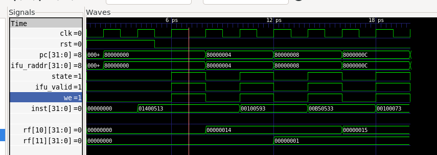
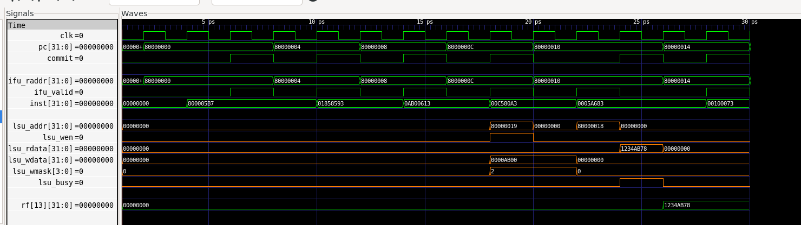
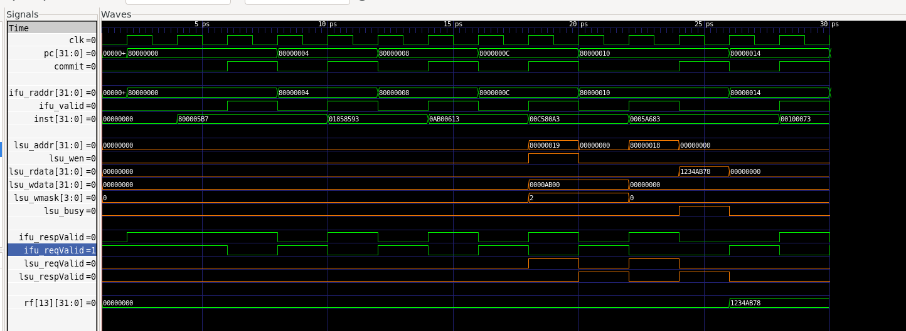
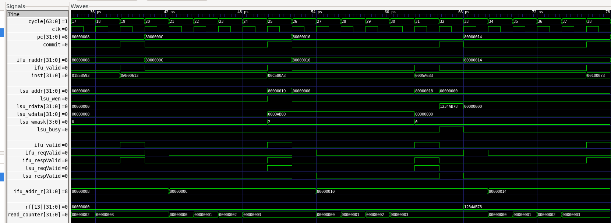

# ysyx 学习记录

# 第一周 9/8 - 9/10
1. 配置环境
2. E3 

# 第二周 9/11 - 9/17
1. RTL 仿真基础（E4）
2. 完成 NVBoard 数字电路实验（E4）
3. 实现 sCPU 与 sEMU，并进行 DiffTest（E4 完成）
4. 实现 minirv 的指令模拟器 minirvEMU（E5）
5. 用 RTL 实现 minirv NPC（E5，进行中）
6. 学习 Chisel （进行中），考虑在 D 阶段使用


# 第三周 9/18 - 9/24
### 完成用 RTL 实现 minirv NPC，与 minirvEMU 进行 DiffTest（E5 完成）
1. RTL 实现 addi / add / lui / jalr / lw / lbu / sw / sb
2. 加 pmem.cpp 提供 DPI-C 取指/访存
3. 声明 DPI-C sim_ebreak(pc)：top 里用 ebreak_r 锁存, 触发条件是
   posedge clk && !rst && is_ebreak && !ebreak_r, 也就是只在首次命中 ebreak 时
   调用一次, 参数是当前 pc; 同时把 ebreak_r 输出到 ebreak 端口供仿真判断
3. DiffTest
4. 验证：make sim-run 跑 program/prog_*.hex;全部 difftest 通过
### 接入 AM 简易运行时环境（E6）
1. AM 侧: minirv 工具链包装改用 riscv-none-elf-; halt() 插 ebreak 并按约定把状态码放进 a0
2. NPC 侧: PC 复位值改 0x80000000; 存储器扩到 128MB、按基址偏移访问、改为从 .bin 装载
3. REF 侧: minirvEMU 同步基址/容量/装载方式, 新增 mem_index() 统一地址换算
4. 仿真侧: 支持命令行指定镜像; ebreak 时按 a0 判 HIT GOOD/BAD TRAP; 结果码回传给 make
5. 搭建流程: npc.mk 实现 run 规则, make ARCH=minirv-npc ALL=xxx run 一键编译+仿真
6. 验证:
    - ALL=dummy run → HIT GOOD TRAP + PASS
    - ALL=wrong run → HIT BAD TRAP + FAIL
    - riscv-tests: TEST_ISA=i 全部 PASS; ALL=addi PASS
    - 成功捕捉在NPC中注入的错误
    - 加入klib-minirv-npc.a;cpu-tests 全部通过
### 添加UART 支持字符输出
1. 添加UART行为模型； 
    ```text
    putch('A')                                    am/src/riscv/npc/trm.c
      ↓ 编译器
    lui a5,0x10000 ; sb a0,0(a5)                  ← 一条普通 store 指令
      ↓ RTL
    lsu.v: 该 sb 命中 → DPI-C pmem_write(0x10000000, 'A', 0x1)
      ↓ C++ 仿真环境
    pmem.cpp: waddr == UART_ADDR → fputc('A', stderr)
      ↓
    终端上出现 A
    MMIO 的本质: 往存储器设备区写一个字节
    ```
2. 为UART添加状态寄存器 (0x10000004)
    - AM 侧 (trm.c putch): 读 0x10000004 忙等
    - 行为模型 (pmem.cpp pmem_read): raddr == 0x10000004 → (rand() & 0x7) == 0 ? 1 : 0
    - DiffTest : 同一条 load 要保证 DUT 和 REF 读到同一个数； DUT 读状态时 把这个随机值记在 g_uart_status 里; minirvEMU 执行到同一条 LBU 时取 pmem_uart_status()
    - 验证: am-kernels/kernels/hello 输出正常 + Difftest PASS
    
3. 添加时钟支持计时功能
    - 添加时钟行为模型 (pmem.cpp)
        - 地址约定: 0x20000000 读时钟低 32 位, 0x20000004 读高 32 位
        - get_time_us(): gettimeofday() 取主机时间, 减去首次调用时的起点, 单位微秒
        - pmem_read(): 0x20000000 → g_rtc_lo = get_time_us() 的低 32 位
                      0x20000004 → g_rtc_hi = get_time_us() 的高 32 位
    - AM 侧:  __am_timer_uptime() (am/src/riscv/npc/timer.c) 
    - DiffTest: 
      - RTL 的 LW 命中 0x20000000 / 0x20000004 时, pmem_read 依次记录 g_rtc_lo / g_rtc_hi
      - minirvEMU 的 FUNCT3_LW 分支用 pmem_rtc_lo() / pmem_rtc_hi() 取回同一份值
    - 验证: cd am-kernels/tests/am-tests && make ARCH=minirv-npc run mainargs=t, 程序每经过 1 秒就输出一句话
4. benchmark 输出时间或分数
    - microbench: Scored time: 3681.424 ms Total  time: 5081.065 ms
    - dhrystone: Finished in 8 ms
    - mainarg=test: Total time (ms)  : 24057
### 运行红白机游戏
1. 实现字符模式运行fceux-am 

### 通过EDA工具评估NPC的频率
1. 配置ECC, PDK , yosys 
2. 对流水灯进行综合评估 ecc run --project light 
3. 将对存储器的DPI-C访问移动到NPC外部
4. 评估NPC的综合频率：400MHZ

### 性能测试 archbench 
1. bash run-am.sh ARCH=minirv-npc mainargs=test 通过
2. bash run-am.sh ARCH=minirv-npc mainargs=train：
    ARCH      = minirv-npc
    mainargs  = train
    benchlist = 除开303.cproc  无结果
    RTC 频率   = 400 MHz  (E/minirv/csrc/pmem.cpp 的 NPC_FREQ_HZ)
    GEOMEAN   = 563 Marks   MEAN = 1542 

### E6 支持SimpleBus的IFU
1. RTL 侧
    - ifu.v: 加 idle / wait 两态状态机
      - idle: 把 pc 作为 ifu_raddr 发给存储器, 下一拍进 wait
      - wait: 存储器返回的 ifu_rdata 有效, 交给后续模块译码执行, 下一拍回 idle
      - 组合输出 ifu_valid = (state == WAIT), 顶层用它屏蔽非取指周期的状态更新
      - 关键: wait 期间 pc 保持不变, 于是同一个地址连发两拍, rdata 正好在 wait 那拍与 raddr 对上
    - pc_reg.v: 加写使能 we, 只有 ifu_valid 那拍才更新 PC
    - dpic_mem.v: 取指那一路改成寄存读, 实现 1 周期读延迟;
      数据访问那一路暂时仍是组合读 (LSU 留到下一节再改)
    - top.v: 用 ifu_valid 门控所有状态更新, 否则 idle 拍会拿上一个地址的旧数据当真去译码
      - rf_we = gpr_we && (waddr != 0) && ifu_valid; pc_we = ifu_valid
      - ebreak 的置位条件加上 ifu_valid
      - lsu 新增 valid 端口, 无效周期不产生任何访存
      - misalign 寄存一拍: 它是组合值, wait 之后立刻回 0, 不寄存仿真环境就看不到
2. DiffTest 适配: 把检查时机改成"只有一条指令执行结束才检查"
    - 一开始用顶层端口方案: top.v 把 ifu_valid 寄存一拍成 inst_valid 端口给 C++ 轮询
    - 后来改成 DPI-C import: ifu.v 里 import "DPI-C" function void sim_retire(input int pc, input int inst),
      在 state 从 WAIT 跳走的那一拍调用 (即指令退休、GPR/PC 提交的同一时刻); C++ 侧
      extern "C" void sim_retire(...) 只置一个 g_retired 标志, 主循环 if (!g_retired) continue;
      这样 top 的端口列表里就不再有为仿真需求而加的 inst_valid 了
    - 回调参数 (pc, inst) 是唯一"同源"的一对快照: 检查时 top->pc 已前进到下一条指令,
      而 top->inst 还停在退休那条, 所以出错打印要用回调存下来的 g_retire_pc / g_retire_inst
3. IPC 测量
    - 周期数 = 仿真环境 single_cycle() 的计数; 指令数 = 退休回调的次数
    - dummy: 17 条 / 34 周期; hello: 17858 条 / 35716 周期, 均为 IPC = 0.50 (2 拍/指令)
4. 验证
    - ALL=dummy / hello run → HIT GOOD TRAP + PASS; ALL=wrong run → HIT BAD TRAP + FAIL
    - prog_add: a0 = 21 (addi a0,zero,20 + add a0,a0,a1)
    - 波形: 
5. 性能测试： 
    - archbench-train:  不包括 303.cproc
        | 日期 | commit | ARCH | mainargs | 成功/总数 | GEOMEAN | MEAN | 备注 |
        |---|---|---|---|---:|---:|---:|---|
        | 2026-09-22 14:23 | 6e6b6fe* | minirv-npc | train | 19/20 | 279 | 770 | 计数器改 64 位后复测 (RTL 同上一行, 分数一致) |

### E6 支持SimpleBus的LSU
1. RTL 侧
    - dpic_mem.v: 数据那一路也改成寄存读, 和取指统一成"读延迟一拍、写在发请求那拍完成"
    - lsu.v: 
      - 加 SimpleBus 请求接口 `lsu_addr` / `lsu_wdata` / `lsu_wmask` /`lsu_re` / `lsu_wen`, 只在发请求那拍有效
      - `wait_data`: 发读请求的下一拍拉高, 表示还在等数据, load 因此多花一个周期; 对外输出 `lsu_busy = wait_data`
      - `rdata` 直接从 `lsu_rdata` 选字 / 选字节: 等数据那拍 IFU 还停在同一指令上(pc 未推进),
        `lsu_op` / `addr` 仍有效; sb 的字节处理靠 `wdata << (addr[1:0] * 8)` + `4'h1 << addr[1:0]`
    - ifu.v: 加 `lsu_busy` 输入, 等 load 期间停在 IDLE 不发新的取指请求
    - top.v: `commit = (ifu_valid && !inst_is_load) || lsu_busy` (load 推迟到等数据那拍退休);
      `pc_we = commit`, `rf_we = gpr_we && (waddr != 0) && commit`
2. DiffTest 适配: 把退休回调 `sim_retire(pc, inst)` 的条件从 ifu_valid 换成 commit 即可
3. 时序 (prog_sb): 
    ```text
    +0x00  lui  a1, 0x80000      ← a1 = 0x80000000
    +0x04  addi a1, a1, 24       ← a1 = 0x80000018 (数据的字节地址)
    +0x08  addi a2, zero, 0xab   ← a2 = 0xab
    +0x0c  sb   a2, 1(a1)        ← 0x12345678 变成 0x1234AB78
    +0x10  lw   a3, 0(a1)        ← a3 = 0x1234AB78
    +0x14  ebreak
    +0x18  0x12345678            ← 数据
    ```
    - 
4. 验证
    - riscv-tests `TEST_ISA=i`: 76 PASS / 0 FAIL; cpu-tests 全 PASS (`wrong` 按设计应 FAIL)
    - ALL=dummy / hello → HIT GOOD TRAP + PASS; ALL=wrong → HIT BAD TRAP + FAIL
    - prog_sb: a3 = 0x1234ab78 + Difftest PASS (原程序用的是基址 0 的地址, 跑时先 `lui`+`addi` 搭基址)
    - 越界访问警告: 修好地址门控前 13 个 → 修好后 0 个
    - IPC: add 4273 条 / 9624 周期 = 0.44
5. 性能测试
    - archbench-train: 不包括 303.cproc
        | 日期 | commit | ARCH | mainargs | 成功/总数 | GEOMEAN | MEAN | 备注 |
        |---|---|---|---|---:|---:|---:|---|
        | 2026-09-22 17:47 | 82e13c8* | minirv-npc | train | 19/20 | 239 | 662 | 支持simplebus的lsu |

### E6 支持有效信号的SimpleBus协
1. RTL 侧
    - 思路: 前面靠的是"wait 期间 pc / 地址保持不变, 数据正好在下一拍对上"这种时序约定, 现在改成握手
      - `xxx_reqValid`: 主设备发请求, 只拉一拍 (持续拉高就等于重复发请求)
      - `xxx_respValid`: 从设备回响应, 与读数据同拍; 协议要求不早于请求的下一拍
    - dpic_mem.v: 只在 `reqValid` 那拍真的访存, 并寄存一拍产生 `respValid`
      - 读 `xxx_rdata <= reqValid ? pmem_read(addr) : 保持`; 写 `if (reqValid && wen) pmem_write(...)`
    - ifu.v: 
      - 两个状态: IDLE(空闲, 可以把请求送出去), WAIT(已经发出请求, 在等响应)
      - 状态转移: IDLE 时 reqValid 把请求发出去, 跳到 WAIT; WAIT 时收到 respValid, 跳回 IDLE
      - `ifu_reqValid = (state == IDLE) && !lsu_busy`: 决定这一拍要不要发请求;
        要在 IDLE 且 LSU 不忙 (LSU 还在等访存响应时不发)
      - `ifu_valid = (state == WAIT) && ifu_respValid`: 响应到了才认这条指令
      - 没有请求时 `ifu_rdata` 要保持: load 等响应期间 IFU 空闲, 下游译码还要靠这条 hold 住的指令
    - lsu.v: 
      - 两个状态与 ifu.v 同理: IDLE 时若是访存指令就跳到 WAIT, WAIT 时收到存储器的 respValid 跳回 IDLE
      - `lsu_busy = (state == WAIT)` 这条 load 还没结束的标志； 
        - 给 IFU ：这拍 IFU 不发新的取指请求，避免取指和访存抢存储器
        - 给顶层： 非 load 指令在取指响应那拍就退休commit，load 要推迟到 lsu_busy 这一拍（数据到齐、能写回 GPR）才退休commit。
      - `lsu_reqValid = (state == IDLE) && (is_load || is_store)` 空闲且这条指令时方访存时发送请求。 
2. 时序 (prog_sb)
    - 取指: `ifu_reqValid` / `ifu_respValid` 交替出现, 且 `ifu_respValid` 与 `ifu_rdata` 同拍
    - 写 `sb`: `lsu_reqValid` 那一拍就 commit (2 拍/指令); 读 `lw`: 还要多等 `lsu_respValid` 那拍才 commit (3 拍)
    - 
3. 验证
    - riscv-tests `TEST_ISA=i` 76 PASS / 0 FAIL; cpu-tests 全 PASS; hello / dummy → HIT GOOD TRAP + Difftest PASS
    - prog_sb 6 条 / 13 周期; add 4273 条 / 9624 周期 = 0.44
4. 性能测试
    - | 日期 | commit | ARCH | mainargs | 成功/总数 | GEOMEAN | MEAN | 备注 |
        |---|---|---|---|---:|---:|---:|---|
        | 2026-09-23 09:42 | 37215c3 | minirv-npc | train | 19/20 | 239 | 662 | 支持有效信号的SimpleBus协议 |

### 存储器中添加随机延迟
1. 取指延迟-5 cycle， 访存保留之前
    - 
    - 

2. 
### 其他

## TODO 
- 存储器表示: REF(minirvEMU) 按字存 (`uint32_t M[]`, 字节访问靠移位+掩码),
   NPC 侧 pmem 按字节存 (`uint8_t pmem[]`, 字访问靠拼接)。对外接口都是 32 位字 + `wmask` 字节掩码, 语义等价;
- 过一遍minirv代码 + 批量运行程序
- 学习 Chisel 
- ~~archbench 现在只能跑通 11/21,其余十个有编译问题 （ai 修了~~
- archbench 303 无结果： 303.cproc 是编译器，启动就必须 fopen("input/train-Block.i") 读源文件，而 minirv-npc 平台上 FILE 这一层不可用（klib 是预编译且混淆的 fileio.o，本地没有 fileio.c 源码），于是 AM Panic: unsupport FILE → halt(1) → HIT BAD TRAP: a0=1，程序没跑到打印 [RESULT] 就结束了，所以记 0 分、显示"无结果"。